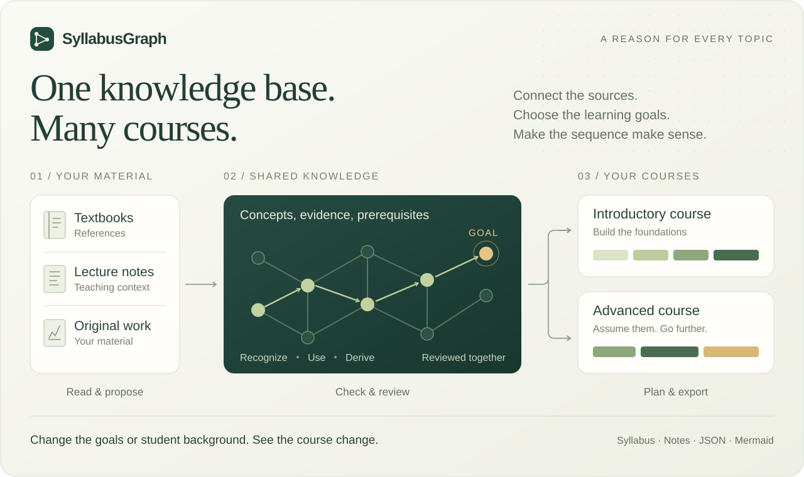
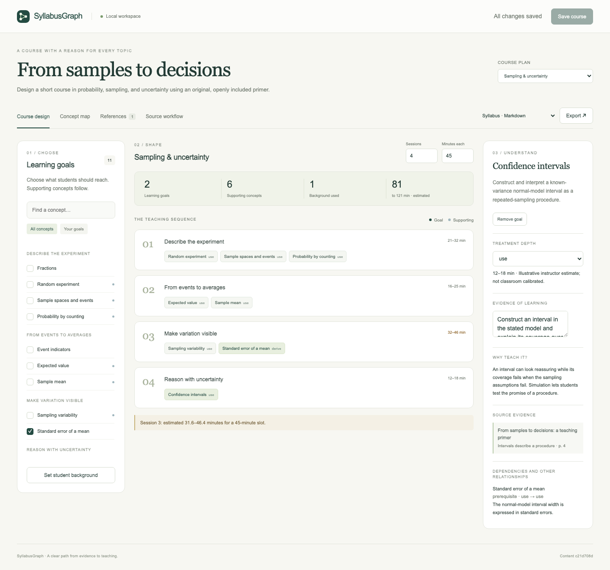

# SyllabusGraph



**A clear path from source material to a teachable course.**

SyllabusGraph connects learning goals to the concepts they depend on and the
sources that support them. Choose what students should be able to recognize,
use, or derive; supply their background; then inspect a proposed sequence,
preparation notes, and the assumptions behind it.

The engine is independent of subject matter. Each project holds a reviewed
knowledge base and one or more course plans. Sources, topic groupings,
narrative choices, and schedules live in project data.

<details>
<summary>See the course designer in action</summary>



</details>

## Try it

Python 3.11 or later is required. The included example needs no model account,
API key, or textbook download.

```bash
git clone https://github.com/OscarBarreraGithub/syllabusgraph.git
cd syllabusgraph
python3 -m venv .venv
source .venv/bin/activate
python -m pip install -r requirements.lock
python -m pip install --no-deps -e .
syllabusgraph demo
```

On Windows, activate with `.venv\Scripts\activate` and use `python` for the
initial command. The app opens at **http://127.0.0.1:8766**. `demo` creates an
editable `sampling-course/` in the current directory and resumes it next time.
Use `--no-open` to start the server without opening a browser.

The sample, **From samples to decisions**, includes an original five-page
primer, a reviewed example graph, and two related course plans. Its teaching
time estimates are illustrative and have not been calibrated in a classroom.

## What you can do

- Choose learning goals and see their supporting concepts appear.
- Specify background at a particular mastery level. Knowing a definition does
  not automatically satisfy a dependency that needs a calculation.
- Build multiple courses over one knowledge base. Later courses can explicitly
  assume the declared outcomes of earlier courses.
- Adjust session count and duration. See missing estimates, potential overload,
  and excluded prerequisites instead of silently losing those constraints.
- Inspect source references, teaching motivations, alternate routes, and a
  simplified dependency map.
- Export a syllabus, preparation scaffold, JSON plan, or Mermaid diagram.
- Attach local source files and process them through a resumable
  proposal → check → review → promote workflow.

The app serves a **local workspace**. It has no telemetry, hosted account,
external font dependency, or automatic model calls. Attached working copies and
extraction runs stay under the ignored `.syllabusgraph/` directory.

## Create your own course

```bash
syllabusgraph init local-courses/my-course --title "My course"
syllabusgraph serve -p local-courses/my-course --open
```

Every new project includes a `README.md` with instructions and a **`materials/`
folder for your reference files**. The same layout applies to every subject:

```text
local-courses/my-course/
  README.md             Start here
  materials/            Put your PDFs, text files, and Markdown notes here
  project.yaml          Project settings and reference bibliography
  knowledge/graph.yaml  Reviewed concepts and relationships
  plans/                Course goals, background, and schedules
```

In the app, open **References**, use **Add reference** if the book is not already
listed, then click **Attach file** on its card. Select the file from `materials/`
and confirm its page offset. You can also select a file anywhere on your computer.

Copying a file into `materials/` does not register or extract it. Attachment
links it to a reference and saves a working copy under `.syllabusgraph/sources/`.
Both directories are ignored by Git, including text and Markdown material.
You can create projects anywhere; `local-courses/` is a convenient directory
inside a checkout that also keeps your course drafts out of the tool's repository.

<details>
<summary>Attach a reference from the command line</summary>

After placing `reference.pdf` in the project's `materials/` folder:

```bash
syllabusgraph source -p local-courses/my-course add reference-one \
  --title "My reference" --author "Author name" --edition "First edition"
syllabusgraph source -p local-courses/my-course register reference-one \
  local-courses/my-course/materials/reference.pdf --page-offset 12
```

The page mapping above means printed page 1 is PDF page 13; confirm the mapping
for your own edition. File arguments are relative to your terminal's working
directory, or can be absolute paths.

</details>

Next, follow the [source workflow](docs/source-workflow.md) to prepare a small
page range, run your preferred extraction tool or import a manually prepared
proposal, check its evidence, review it, and promote accepted records. Then
edit course outcomes and assumptions using the [project format](docs/project-format.md).

## The QFT project

```bash
syllabusgraph init local-courses/qft --template qft
syllabusgraph serve -p local-courses/qft --open
```

Put the books in **`local-courses/qft/materials/`** and attach them through
**References**, using the same workflow as any other course. `examples/qft/`
contains the reusable template; the directory passed to `init` is your working
project. QFT has no special source-file location or processing path.

This creates a **preparation scaffold** for QFT I and QFT II with source entries
for Weinberg volumes I and II, Peskin–Schroeder, and Schwartz. **Its knowledge
base is intentionally empty:** no textbook extraction, scientific review, or
finished QFT curriculum is claimed. Attach the materials, confirm editions,
specify the audience and semester boundary, and begin with one coherent unit.
See [preparing QFT](docs/qft-preparation.md).

The local app, PDF text reader, review workflow, planner, and exports are ready.
Building the QFT graph still requires the materials, source review, and course
design decisions. Proposals can be authored manually or with an external AI
tool and imported. **Automatic AI extraction requires a separately configured
command adapter; no model client is bundled.** Scanned PDFs need OCR before
import. Ordinary text PDFs can be processed with the included reader, though
mathematical notation still needs inspection against the original pages.

## Reproduce a build

```bash
syllabusgraph validate -p sampling-course
syllabusgraph build -p sampling-course --strict
syllabusgraph plan -p sampling-course --plan foundations --format notes
syllabusgraph compare -p sampling-course foundations simulation-lab
```

Builds go into `.syllabusgraph/build/` by default. The same reviewed records and
configuration produce the same meaningful outputs and content digests across
checkouts. Run timestamps are kept out of content identity. Fresh model
extraction produces a new proposal and must be reviewed; it is not guaranteed
to reproduce the same words or graph.

`validate` checks data contracts and references. `build --strict` also returns
a failure status for blocking planning errors. Neither command certifies the
scientific truth of the source claims or the effectiveness of teaching.

## Development

```bash
python -m pip install -e '.[dev]'
python -m pytest
ruff check .
python -m build
```

For a fully locked development environment, use `uv sync --locked --all-extras`.
For browser tests, install the `browser` extra and run:

```bash
python -m playwright install chromium
python scripts/test_browser.py
```

The core suite covers mastery-sensitive closure, ordering, course inheritance,
timing uncertainty, reproducible output, source checks, stale reviews, atomic
promotion recovery, CLI use, and HTTP boundaries. The browser test exercises
editing, export, persistence, source upload, and mobile layout on disposable
projects. See [architecture](docs/architecture.md) and
[release checks](docs/releasing.md).

MIT licensed. Included sample text and data are original project materials.
Users supply their own source books; the repository does not distribute them.
