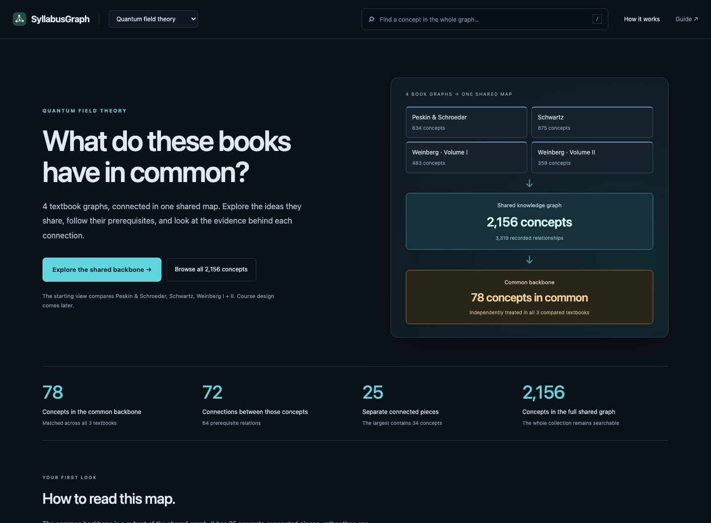

# SyllabusGraph

**Turn source material into a map of ideas, then shape a course around it.**



Bring your references. Your coding agent handles installation, extraction, and
independent review. You decide what to cover and, later, what to teach.

| Bring | Connect | Shape | Share |
|---|---|---|---|
| Drop your material into a private folder. | Build concepts and relationships with source evidence. | Choose goals, background, and time. | Publish graphs and course plans; keep the books private. |

## Get started

Paste this into **Codex or Claude Code**:

```text
Get me set up with SyllabusGraph. Read and follow
https://github.com/OscarBarreraGithub/syllabusgraph/blob/main/SETUP.md
Handle the technical setup for me, then show me where to put my materials.
Use the slow, checkpointed mode. Ask about scope and model choices before extraction.
```

Your agent opens the local website, creates your workspace, and explains the
next step. You don't need an API key to browse existing graphs. Extraction uses
your coding agent's model access: Terra/high + Sol/high by default in Codex,
Sonnet + Opus in Claude. The choices are configurable; an independent critic is required.

> **Graph creation can use a lot of your model allowance.** Start with a few
> pages. Slow mode allows two worker dispatches per session, with one worker
> at a time, then pauses. Resume whenever you choose—even weeks later.
> These are call limits, **not a token or spending cap**. One call and the
> orchestrator can still use substantial allowance. Nothing runs in the background.

To continue another day, tell your agent: **“Resume my SyllabusGraph project for
one slow session. Read its saved state first.”**

## Explore the example

The [QFT collection](graphs/subjects/qft/README.md) has four textbook graphs and
one shared graph: **2,156 concepts and 3,319 relationships**, with book
correspondences and page references. The website opens with an **overview** of
the collection, its overlap, and how to explore it. Open the **shared backbone**
to follow common concepts and their connections in a scrollable, expandable map.
Select a concept to inspect evidence or explore its wider dependencies.
The book index is available separately. No course has been chosen; browsing makes
no model calls.
The graphs are model-reviewed; human audit is pending.

[Field guide / docs](docs/README.md) · [Graph library](graphs/README.md) ·
[Usage & run history](docs/usage-estimates.md) · [Contribute](CONTRIBUTING.md)

To have your agent explain the documentation, paste:

```text
Read https://github.com/OscarBarreraGithub/syllabusgraph/blob/main/docs/README.md
and explain the next step for my SyllabusGraph project. Inspect saved work first;
do not start extraction or renew a work budget just to answer.
```

MIT licensed. Source books are supplied locally and are not distributed here.
