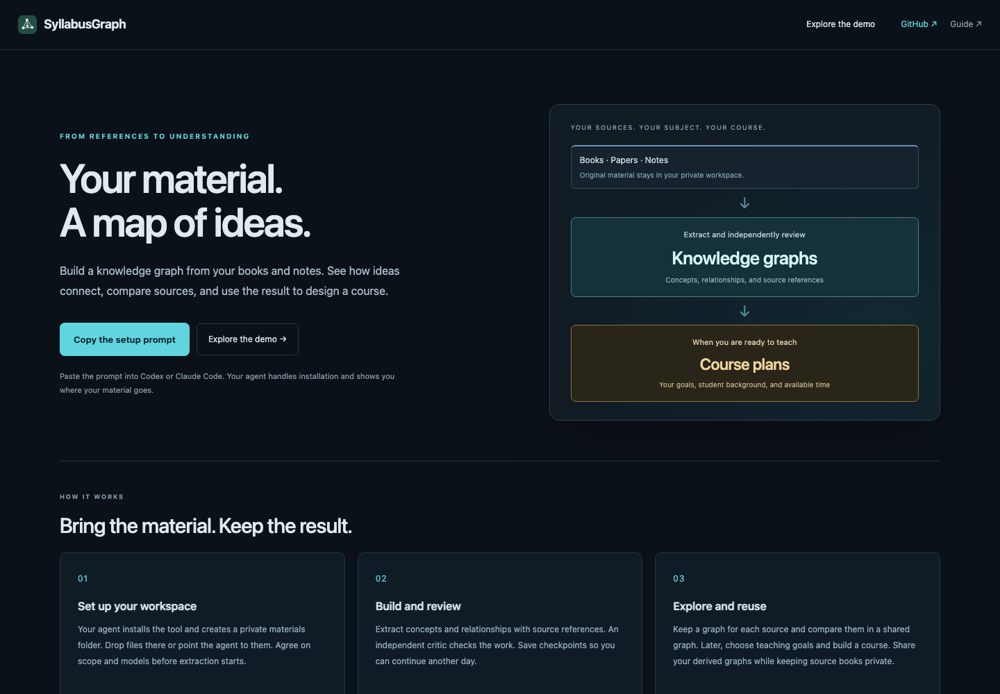
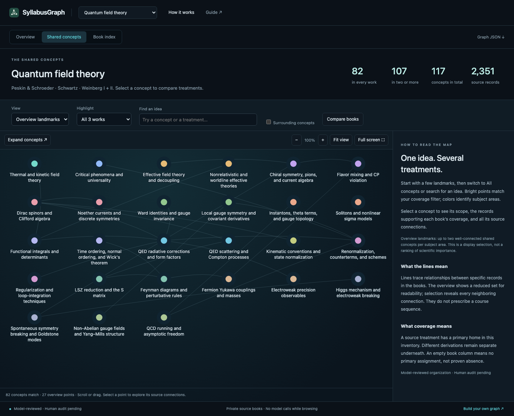
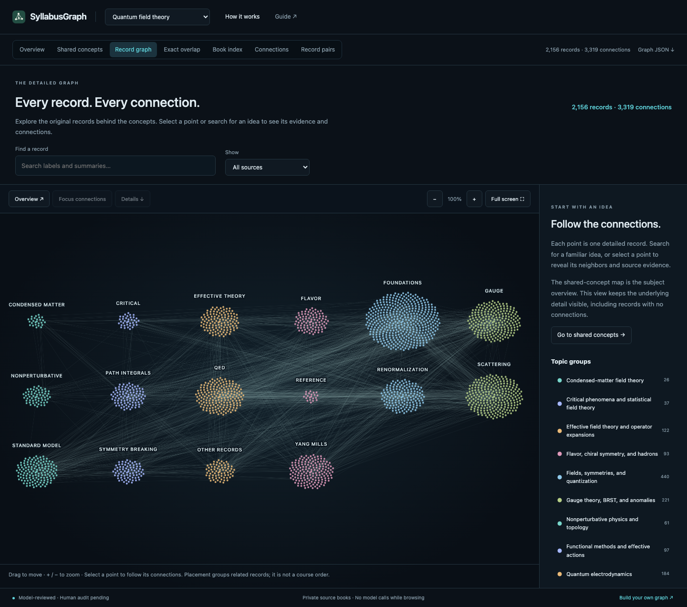
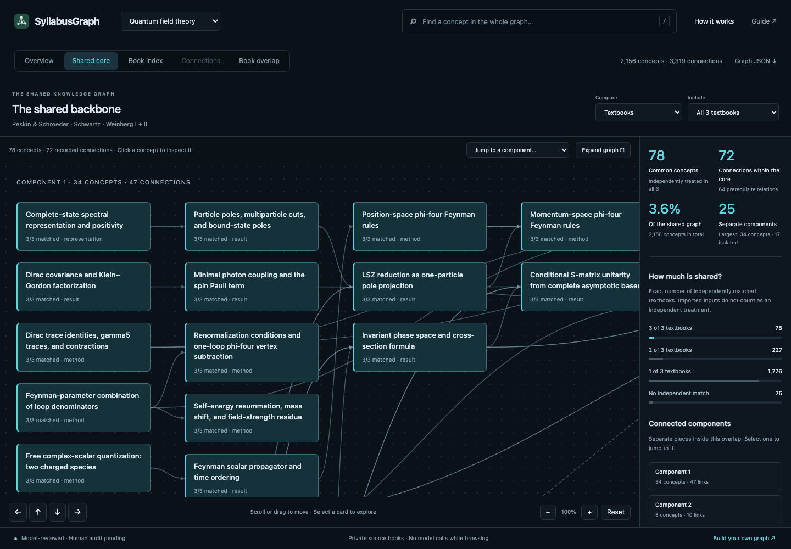
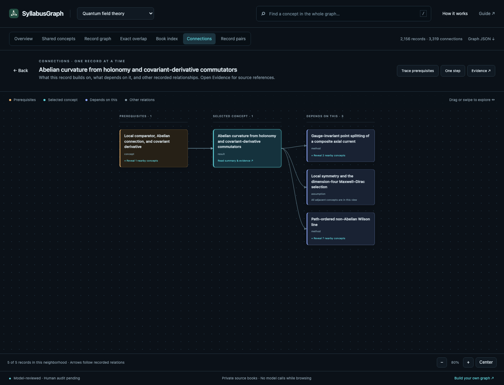

# Graph explorer and website

The read-only explorer works without a course plan. It uses the actual graph
records, with no model calls, external fonts, analytics, or JavaScript packages.
A local editable course designer remains a separate interface.

Ask your agent to follow [SETUP.md](../SETUP.md) to open it. The commands below
are for agents and maintainers.

```bash
syllabusgraph site serve --port 8767 --open
syllabusgraph explore -p local-courses/my-course --port 8768 --open
```

`site serve` builds the explicit [catalog](../site/catalog.json) and serves it
on loopback. `explore` does the same for one project. Restart/rebuild after graph
edits. The public catalog contains the QFT collection; new projects remain
subject-neutral. To show other graphs, supply your own `--catalog PATH` with
`graphs` entries containing `id`, `path`, `title`, and optional `kind`.
Paths are relative to the catalog file.

## Reading the map

The homepage explains **SyllabusGraph**, its workflow, and how to reuse it with
your own references. Copy the setup prompt directly from the page. The prompt
selects slow, checkpointed mode and points the coding agent to the full setup
guide. Usage limits are explained before the example.



Choose **Explore the demo** to open the collection's **Overview**, then
**Open the concept map**. The QFT example starts with 27 landmarks from its
82 shared concepts. Headline counts distinguish all-three-work coverage,
at-least-two-work coverage, the complete 117-concept inventory, and its 2,351
source records. Weinberg I + II count as one work; book comparisons keep volumes
separate. The homepage stays about the reusable tool.



Select a concept to see its treatments by book and every connected concept.
Open a source link for the original relationship and citations; follow a
treatment into the detailed graph. Browser Back returns to the concept.
Switch **Landmarks → All concepts** for the complete eligible set, widen the
coverage filter, add surrounding context, or search concept and treatment labels.
The map opens at a fitted scale and adapts its columns to the available space.
Use **Expand concepts** to animate between landmarks and the full eligible
inventory; the coverage filter still applies. Selection is preserved, rapid
reversals are safe, and reduced-motion settings skip the transition.

Scroll, drag, swipe, or focus the map and use arrow keys. **Fit view**, zoom
percentage, +/−, and **Full screen** stay above the map. Escape exits full screen.
On narrow screens the details move below the canvas; **Back to map** returns
you to it. Browser zoom stays independent of graph zoom. Selection and filters are shareable URLs,
for example `#graph=qft&view=atlas`.

The lines project exact existing book relationships through reviewed primary
topic assignments. They do not assert universal prerequisites or a course
order. The reduced opening view is editorial; its
[selection rule, coverage, and review scope](../graphs/subjects/qft/concepts/README.md)
are published. All underlying relationships remain inspectable on selection.

For another subject, add `inventory: "path/to/concepts"` to a collection's
catalog entry. That directory contains `inventory.json`, `inputs.json`, and
`review.yaml`; paths are relative to the catalog file. The build requires a
model-reviewed declaration bound to the inventory digest, verifies pinned book
versions and memberships, and derives connections from the book graphs in the
same catalog. See the [inventory workflow](concept-inventories.md). No model
calls or original textbooks are needed to rebuild an accepted inventory.

The earlier [nine-concept pilot](../graphs/subjects/qft-path-integrals/README.md)
remains available separately. Other small authored concept maps can use catalog
`kind: concept-map`; an optional `concept_map: "<entry-id>"` links a collection
to one. A full inventory takes precedence when both are configured.

**Record graph** opens the detailed graph as compact points with the original
connections. **Map all records**, chapter links, and **Record pairs** open this
view directly instead of a long list. Search selects a point on the map; the
source filter limits it to one reading view. The opening camera fits every
record, including isolated ones. Select a point to highlight its neighbors,
then use **Focus connections** or **Overview** to move smoothly between detail
and the full graph. **Details** brings its summary and evidence link into view.
The overview can show thousands of points; use search or a topic-group button
when individual labels are too small to pick out.



Drag to pan, use +/− to zoom, or use Alt-wheel over the map. Ordinary scrolling
and browser zoom keep their normal behavior. The focused map accepts arrow
keys and Home; search results are keyboard accessible. Full screen and reduced
motion are supported. Selection, source, chapter, and pair filters survive a
reload; old list URLs open the corresponding graph. The **Evidence & full
connections** action opens the original record, and Back returns to the map.

Positions use existing topic groups, or source groups when no inventory exists.
When a merged record has several topic homes, a deterministic choice places it
in one display group; its original treatments remain unchanged. Records without
a direct match to the inventory stay visible under **Other records**, with
their evidence intact. Distance,
color, and position do not establish equivalence or a prerequisite. Only recorded
edges are drawn. The map uses a finite layout and camera transitions, with no
ongoing simulation or model calls.

The background connections are drawn once into a bounded bitmap and moved
with the camera. Points, labels, and selected connections stay sharp; the faint
background lines can soften at high magnification. Pointer events share one
render per frame, and nothing animates while idle. This keeps the complete
graph available without thousands of interactive SVG elements.

For performance comparisons, run `python scripts/profile_record_graph.py`
against a served site (use `--url` for a different address). It exercises hover,
selection, animated focus/overview, pan, and zoom in Chromium at a 1440×1000
viewport, 2× pixel density, and 4× CPU slowdown. Reports stay under ignored
`.syllabusgraph/performance/`. Measure the same graph and interactions before
and after a change; frame times depend on the machine and browser. The initial
QFT comparison reduced the 95th-percentile frame interval from 33.4 ms to
16.8 ms and recorded no interaction long tasks after the change. This measures
interaction after loading, not download or startup time.

The navigation row stays available throughout the demo, including the overview
and shared-concept atlas. It wraps when browser zoom reduces the available
width. Statistics and evidence move below the graph on smaller screens instead
of disappearing or covering the drawing.

The secondary **Exact record overlap** diagnostic shows records explicitly matched across the
compared works, with their connections and basic statistics. It is not an
established conceptual backbone or a count of every shared topic. See the
[abstraction audit](graph-abstraction.md) for the distinction and review history.
It does not choose a course, reading sequence, audience, or timetable.
Previously shared exact-overlap links still open that diagnostic, with a button
to the collection's concept map when configured. The example's 78 exact matches
remain unchanged; adding the subject inventory did not realign the full record graph.



The QFT catalog compares Peskin–Schroeder, Schwartz, and Weinberg I + II by
default. **Compare → Individual volumes** treats the four book graphs separately.
**Include** widens the intersection to concepts matched in at least two books.
The graph displays every qualifying concept and every shared-graph relation
whose endpoints qualify. Hover to highlight connections; click a concept for
its wider neighborhood and source evidence. Scroll in either direction, drag
the map (including from a card), or use the arrow buttons to move. A focused
map also accepts arrow keys. **Expand graph** gives it the window; the exit
button or Escape returns to the normal workspace. Zoom this diagnostic with +/−; **Reset** returns to the wider starting scale of 80%.
Ctrl/Command browser zoom retains its normal behavior. Jump to separate
components from the sidebar or the selector above the map. On touch screens,
swipe to move. The overview scrolls as a normal page; the map scrolls within its
own viewport. Short windows can also scroll the page to reach the controls.

The counts distinguish exact book membership, prerequisite relations, connected
components, isolated concepts, and the fraction of the whole shared graph.
Components use all relation types, ignoring direction only when measuring
connectivity. Layout ranks use prerequisite arrows. Nodes shared by all books
do **not** imply that every connecting relationship is asserted in every book.
Imported prerequisites are excluded from independent treatments. These are
recorded correspondences, not proof of exhaustive overlap. Paths through
nonqualifying concepts are not silently replaced by new edges.

Grouping is explicit catalog data: use `comparison_group: {"id": "work-id",
"title": "Work title"}` on book entries that should count as one work. No author
names or project-name prefixes are inferred by the engine. A core comparison
requires the book graphs named by the shared graph's origins to be in the
catalog; missing exports cannot silently lower the comparison denominator.

**Book index** is a secondary way to find concepts using source chapter/page
order. It is not a course. Change **Read through** to browse another book without
leaving the shared graph. **Full record graph** and the search box cover the whole
selected graph, including concepts outside the current book or common core.
Standalone textbook and example graphs have their own overview and a direct
button to their concept index. Empty projects offer the setup guide.

**Connections** explores one selected record. Choose a point in **Record graph**
and open the tab, or open a card from another view. With no selection, the tab
explains its purpose and offers **Find a record**. Prerequisites are on the left,
dependents on the right, and other connections in a separate column. Arrows
preserve the recorded direction; dashed arrows denote other relation types.
Full concept names remain visible. Click a neighbor to make it the selection,
or use **Reveal** to add its neighbors to the current diagram. **Back** retraces
concepts you have opened. Hover or keyboard focus highlights connected cards.



**Trace prerequisites** follows only recorded prerequisite edges, recursively.
**One step** restores the immediate neighborhood. Large columns initially show
eight concepts with explicit totals and **Show more** buttons; every remaining
concept can be revealed. Drag empty space, use the scrollbars, or swipe to pan.
Zoom buttons adjust card size; **Center** returns to the selection at 80%.
This is a reading interface, not a proposed course sequence or a whole-graph
force layout.

**Evidence** opens the summary, notation, qualifications, source sections and
pages, and the complete list of connections. Expand a relationship to read its
rationale, necessity, mastery levels, and evidence. Follow a book treatment to
its original node, or copy a link to the selected concept. **Record pairs**
opens pairwise comparisons based on independent treatments; imported textbook
inputs are excluded, matching the graph-bank checker. Include the relevant book
graphs in the catalog to resolve those comparisons.

### Where chapter columns come from

The exporter reads chapter page ranges from a project's public `coverage.yaml`,
when present. For a shared graph, it follows exact book origins before assigning
chapter membership. Companion pagination and imported evidence are not treated
as pages in the primary book. A concept with citations in several chapters can
appear in several columns; the reading-view total counts it once. Shared concept
counts can differ from the original book's node count.

Chapter topic captions summarize existing graph groups; they are **not official
chapter titles**. Unmapped records remain in an **Other concepts** column. Without
a chapter inventory, the interface uses existing groups and an ungrouped column.
Blank projects need no chapter configuration. In a multi-book catalog, mark the
combined graph `kind: shared` and the individual books `kind: textbook` to create
book reading views. A standalone export still works without the other books.

The graph JSON retains the complete, unchanged knowledge graph. It adds selected
bibliography fields, review status, digest, and derived reading/comparison
metadata. It does not include source files, PDFs, private workflows, credentials,
or local paths. This export is **not a redaction service**: never put private
material in public graph fields. Review new catalog entries before publication.

## Public website and deployment

[Science with Agents](https://sciencewithagents.com) hosts SyllabusGraph as the
entire site. Both `sciencewithagents.com` and `www.sciencewithagents.com` serve
the same generated application. The homepage introduces the reusable tool;
QFT is the included demo. Unknown paths return the SyllabusGraph 404 page.

The site is an assets-only Cloudflare Worker. It has no runtime model calls,
account system, database, upload endpoint, or public access to your local server.
See the current [Cloudflare static assets documentation](https://developers.cloudflare.com/workers/static-assets/).

From the repository, after Python setup:

```bash
syllabusgraph site build
npm ci
npm run deploy:check
npm run preview
```

`wrangler.jsonc` points only at `.syllabusgraph/site/`. `preview` uses Wrangler
locally at port 8787; `deploy:check` validates the actual build without deploying.
Node and Wrangler are needed only for this hosting path, not the local app.

The `production` environment in `wrangler.jsonc` names the `syllabusgraph`
Worker and its two custom domains. Production `workers.dev` and version preview
URLs are disabled. `npm run deploy:check` and `npm run deploy` select this
environment; `npm run preview` stays local. Check `npx wrangler whoami` before
publishing and use the account that owns the domain. No account IDs or
credentials belong in the repository.

For a collaborator's own deployment, change the production Worker name and
custom-domain routes to their explicitly chosen hostname before publishing.
Local setup never deploys or asks them to configure Cloudflare. All application
assets use relative URLs and can also be hosted as static files elsewhere.

```bash
npm run deploy
```

That command rebuilds the catalog before publishing. Deploy only the generated
site directory. A rebuild rejects unexpected files in the output directory.
Never upload the repository root or use the writable course server as a public
service. Publication is an explicit maintainer step: pushing to GitHub runs
checks but does not deploy. After a release, verify both hosts, a direct graph
link, setup-prompt copying, source drilldown, and a missing path against the
live site. Keep the README and repository website link pointed at the public
homepage.
