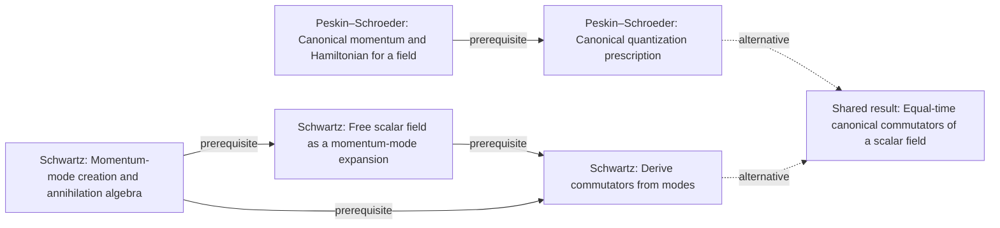

# Quantum field theory graph collection

**Construction in progress:** four independent textbook graphs currently contain 2351 reviewed concepts. The shared graph contains 1386 concepts and 1710 relationships, mapping 1591 distinct book concepts through explicit origins.

Terra/high performs extraction and alignment; independent Sol/high review precedes promotion. All four textbook graphs have completed their source scopes and whole-book audits. The **shared graph is partial**, and the end human audit is pending. Shared alignment covers the bounded book inputs recorded in review.yaml; other accepted book additions remain to be aligned. Shared alignment and its combined dependency audit must finish before calling this collection complete.

| Book graph | Printed pages in accepted units | Concepts | Relationships |
|---|---|---:|---:|
| [Peskin–Schroeder](../../textbooks/peskin-schroeder/README.md) | 3–263, 265–345, 347–391, 393–471, 473–649, 651–777, 779, 781–810 | 634 | 844 |
| [Schwartz](../../textbooks/schwartz/README.md) | 3–105, 109–284, 287–477, 481–699, 703–811, 813, 815–833 | 875 | 972 |
| [Weinberg I](../../textbooks/weinberg-1/README.md) | 1–189, 191–595 | 483 | 631 |
| [Weinberg II](../../textbooks/weinberg-2/README.md) | 1–59, 63–247, 252–474 | 359 | 410 |

The reviewed inventories account for 2,646 numbered pages and 605 section entries. Accepted full extraction scopes cover all 2646 of those pages; narrow pilots are excluded from that measure. The historical page denominator retains three explicitly annotated title-only dividers, which require no concept nodes. Each book links its accepted whole-book conceptual-coverage and dependency assessment. Shared alignment and the final combined-graph audit remain in progress. [Read the final inventory decision](review-decisions.yaml).

[Read the shared graph](knowledge/graph.yaml) · [Coverage and review record](review.yaml) · [Final scientific decisions](adjudications.yaml) · [Time and usage](usage.md) · [Graph bank instructions](../../README.md)

## Correspondences in reviewed portions

A shared node's `origins` identify the book concepts it represents and explain the scope of the match. Related treatments can remain distinct: these counts measure explicit shared-node correspondences, not every conceptual similarity. Imported textbook inputs remain traceable in origins but do not count as independent treatments by the importing book.

| Book pair | Shared concepts in extracted portions |
|---|---:|
| Peskin–Schroeder / Schwartz | 137 |
| Peskin–Schroeder / Weinberg I | 22 |
| Peskin–Schroeder / Weinberg II | 38 |
| Schwartz / Weinberg I | 22 |
| Schwartz / Weinberg II | 26 |
| Weinberg I / Weinberg II | 3 |

**These numbers are not whole-book overlap estimates.** The reviewed inputs cover different portions of the subject. A zero means no shared-node mapping in the aligned inputs; it does not mean either book omits the topic.

Examples of the mapped concepts (the YAML contains every correspondence):

| Shared concept | Book origins |
|---|---|
| Abelian curvature from holonomy and covariant-derivative commutators (`qft.abelian-curvature-from-holonomy`) | Peskin–Schroeder: `peskin-schroeder.abelian-curvature-from-holonomy-and-covariant-commutator`; Schwartz: `schwartz.abelian-wilson-loop-curvature`; Peskin–Schroeder: `peskin-schroeder.abelian-wilson-line-and-loop` |
| Adjoint representation and covariant derivative (`qft.adjoint-representation-and-covariant-derivative`) | Peskin–Schroeder: `peskin-schroeder.adjoint-representation-covariant-derivative-and-bianchi-input`; Schwartz: `schwartz.adjoint-representation-of-gauge-fields` |
| Classical vector and axial currents in QED (`qft.align006.classical-vector-axial-currents`) | Schwartz: `schwartz.classical-vector-axial-currents`; Peskin–Schroeder: `peskin-schroeder.dirac-vector-and-axial-currents`; Schwartz: `schwartz.dirac-noether-number-current` |
| Strong-CP anomalous rotation relation (`qft.align006.strong-cp-anomalous-rotation-relation`) | Schwartz: `schwartz.strong-cp-anomalous-rotation-relation`; Schwartz: `schwartz.anomalous-chiral-rotations-and-theta-terms`; Schwartz: `schwartz.electroweak-theta-unphysical-and-qcd-total-derivative-limit`; Schwartz: `schwartz.strong-cp-bar-theta-basis-invariant-phase`; Weinberg II: `weinberg-2.theta-term-chiral-rephasing-invariant`; Peskin–Schroeder: `peskin-schroeder.theta-terms-chiral-rotations-and-strong-cp` |
| Little-group induced vector representations (`qft.align010.schwartz.little-group-induced-vector-representations`) | Schwartz: `schwartz.little-group-induced-vector-representations`; Weinberg I: `weinberg-1.induced-representations-and-little-groups` |
| Massive vector transverse and longitudinal polarization basis (`qft.align010.schwartz.massive-vector-polarization-basis`) | Schwartz: `schwartz.massive-vector-polarization-basis`; Peskin–Schroeder: `peskin-schroeder.problem-massive-vector-polarization-sum` |
| Massless little-group derivation of the Ward identity (`qft.align010.schwartz.massless-little-group-ward-identity`) | Schwartz: `schwartz.massless-little-group-ward-identity`; Peskin–Schroeder: `peskin-schroeder.ward-identity-external-photon-polarization-sum`; Schwartz: `schwartz.physical-photon-polarization-sum` |
| Particle as an irreducible unitary Poincaré representation (`qft.align010.schwartz.particle-as-unitary-poincare-irrep`) | Schwartz: `schwartz.particle-as-unitary-poincare-irrep`; Weinberg I: `weinberg-1.one-particle-irreducible-poincare-states` |
| Proper-orthochronous Lorentz topology and representations up to a sign (`qft.align010.weinberg-1.lorentz-topology-sign-projective-representations`) | Weinberg I: `weinberg-1.lorentz-topology-sign-projective-representations`; Schwartz: `schwartz.spinor-two-pi-rotation-and-projective-representations` |
| Parity is unitary and time reversal antiunitary (`qft.align010.weinberg-1.parity-unitary-time-reversal-antiunitary`) | Weinberg I: `weinberg-1.parity-unitary-time-reversal-antiunitary`; Schwartz: `schwartz.wigner-time-reversal-antilinearity`; Peskin–Schroeder: `peskin-schroeder.time-reversal-antiunitary-dirac-symmetry` |
| Proper orthochronous Lorentz subgroup and discrete inversions (`qft.align010.weinberg-1.proper-orthochronous-lorentz-component`) | Weinberg I: `weinberg-1.proper-orthochronous-lorentz-component`; Schwartz: `schwartz.groups-representations-and-lorentz-components` |
| Effective action as the 1PI generator and tree reconstruction (`qft.align011.effective-action-1pi-tree-reconstruction`) | Weinberg II: `weinberg-2.effective-action-1pi-tree-reconstruction`; Peskin–Schroeder: `peskin-schroeder.effective-action-1pi-generating-functional` |

Each book README includes a diagram. The YAML retains equations/notation, evidence, mastery requirements, necessity, and source-specific route qualifications. The shared graph is a synthesis; book graphs retain their own organizing groups and motivations.

## One shared result, distinct routes

The shared graph separates a physical result from source-specific methods for reaching it. This view is generated from the reviewed graph; dashed edges mark alternative routes, while solid edges retain prerequisites within a route.



The illustrated result uses two explicit method nodes because the book records combine a route with its result. Shared nodes can merge equivalent book concepts or separate distinct derivation routes, so shared and input counts need not match. The current course planner does not choose an alternative route automatically; that choice belongs to the later course-design work.

## Reuse and continuation

```bash
syllabusgraph validate -p graphs/subjects/qft
python scripts/check_graph_bank.py
```

These commands work from a clone without textbooks, private caches, or a model account. Extending the graphs requires access to the cited material and the usual independent review. Put references in a project's ignored `materials/` directory; extraction records and quote witnesses stay in `.syllabusgraph/`. See the [PDF reading guide](../../../docs/pdf-reading.md) for adaptable setup.

Continue by aligning the remaining reviewed textbook concepts and checking their shared dependencies, retaining each book's treatment and reviewing new correspondences. Coleman and Weinberg III are outside this initial scope. QFT I/II course design follows graph construction; the [roadmap](../../../docs/roadmap.md) records the task of identifying the right questions about goals, background, depth, time, and assessment.
