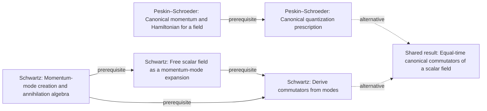

# Quantum field theory graph collection

**Construction in progress:** four independent textbook graphs currently contain 125 reviewed concepts. The shared graph contains 37 concepts and 36 relationships, mapping 36 distinct book concepts through explicit origins.

Terra/high performs extraction and alignment; independent Sol/high review precedes promotion. These are **partial graphs**, with an end human audit pending. The shared graph currently represents the initial 26-page pilot; newer book additions await shared-graph alignment. Full-book coverage, global reconciliation, and that alignment must finish before calling this collection complete.

| Book graph | Printed pages in accepted units | Concepts | Relationships |
|---|---|---:|---:|
| [Peskin–Schroeder](../../textbooks/peskin-schroeder/README.md) | 13–20 | 9 | 7 |
| [Schwartz](../../textbooks/schwartz/README.md) | 21–26 | 7 | 7 |
| [Weinberg I](../../textbooks/weinberg-1/README.md) | 1–48, 201–206 | 65 | 41 |
| [Weinberg II](../../textbooks/weinberg-2/README.md) | 2–40 | 44 | 39 |

[Read the shared graph](knowledge/graph.yaml) · [Coverage and review record](review.yaml) · [Graph bank instructions](../../README.md)

## Correspondences in this batch

A shared node's `origins` identify the book concepts it represents and explain the scope of the match. Related treatments can remain distinct: these counts measure explicit shared-node correspondences, not every conceptual similarity.

| Book pair | Shared concepts in extracted portions |
|---|---:|
| Peskin–Schroeder / Schwartz | 1 |
| Peskin–Schroeder / Weinberg I | 0 |
| Peskin–Schroeder / Weinberg II | 0 |
| Schwartz / Weinberg I | 0 |
| Schwartz / Weinberg II | 0 |
| Weinberg I / Weinberg II | 0 |

**These numbers are not whole-book overlap estimates.** The chosen sections cover different portions of the subject. A zero means no shared-node mapping in these initial batches; it does not mean either book omits the topic.

Inspect the mapped concepts directly:

| Shared concept | Book origins |
|---|---|
| Equal-time canonical commutators of a scalar field (`qft.equal-time-scalar-field-commutators`) | Peskin–Schroeder: `peskin-schroeder.canonical-quantization-real-field`; Schwartz: `schwartz.equal-time-scalar-field-commutation-relations` |

Each book README includes a diagram. The YAML retains equations/notation, evidence, mastery requirements, necessity, and source-specific route qualifications. The shared graph is a synthesis; book graphs retain their own organizing groups and motivations.

## One shared result, distinct routes

The shared graph separates a physical result from source-specific methods for reaching it. This view is generated from the reviewed graph; dashed edges mark alternative routes, while solid edges retain prerequisites within a route.



The synthesis has two explicit method nodes because the book records combine a route with its result. This accounts for the shared graph having more nodes than the total number of input book concepts. The current course planner does not choose an alternative route automatically; that choice belongs to the later course-design work.

## Reuse and continuation

```bash
syllabusgraph validate -p graphs/subjects/qft
python scripts/check_graph_bank.py
```

These commands work from a clone without textbooks, private caches, or a model account. Extending the graphs requires access to the cited material and the usual independent review. Put references in a project's ignored `materials/` directory; extraction records and quote witnesses stay in `.syllabusgraph/`. See the [PDF reading guide](../../../docs/pdf-reading.md) for adaptable setup.

Continue by extracting further bounded textbook sections, retaining each book's treatment and reviewing new correspondences. Coleman and Weinberg III are outside this initial scope. QFT I/II course design follows graph construction; the [roadmap](../../../docs/roadmap.md) records the task of identifying the right questions about goals, background, depth, time, and assessment.
