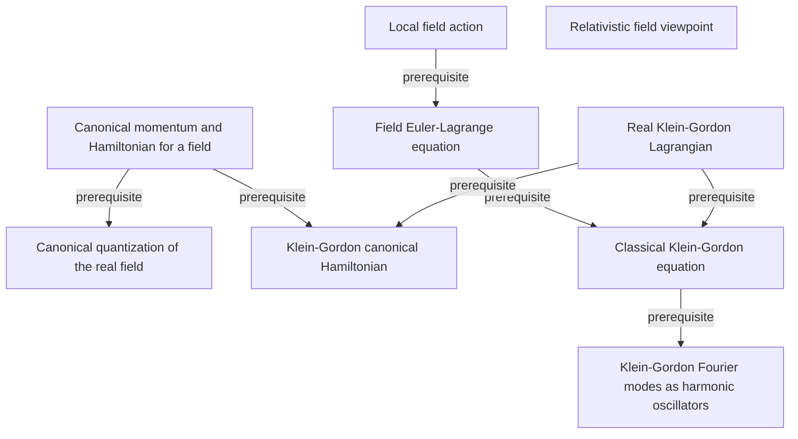

# An Introduction to Quantum Field Theory

**Partial, model-reviewed graph:** 634 concepts and 844 relationships. Accepted units cover printed pages 3–263, 265–345, 347–391, 393–471, 473–649, 651–777, 779, 781–810; exact topic scopes and exclusions are in [review.yaml](review.yaml).

Terra/high extracts the material; independent Sol/high review precedes each promotion. The end human audit is pending. Full-book construction and cross-unit dependency reconciliation are in progress. A listed page range records reviewed scope, not a claim that every topic on a pilot page was extracted.

This graph describes the book independently of any audience, course, or schedule. Textbooks, extracted passages, source-page renderings, and processing records remain private.

[Read the graph](knowledge/graph.yaml) · [Coverage inventory](coverage.yaml) · [Final scientific decisions](adjudications.yaml) · [Shared QFT graph](../../subjects/qft/README.md) · [Graph bank instructions](../../README.md)

The following diagram is a small excerpt from the initial accepted batch. The linked YAML contains the current complete set of accepted records.

The diagram omits mastery levels and detailed qualifications for readability; the YAML preserves the evidence, necessity, rationale, and failure mode for every relationship. Textbooks and quotation checks remain local.
