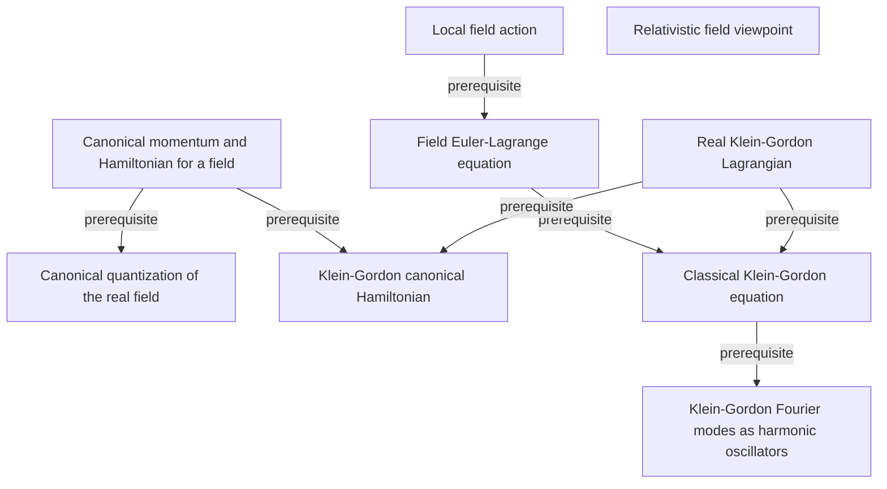

# An Introduction to Quantum Field Theory

**Partial, model-reviewed graph:** 9 concepts and 7 relationships from printed pages 13–20.

Free real scalar-field foundations: why a field description is required in relativistic quantum theory; the action, Euler-Lagrange equation, canonical momentum and Hamiltonian for the Klein-Gordon field; and the opening oscillator-mode treatment of that field.

Terra/high extracted this batch; Sol/high independently reviewed it before promotion. The end human audit is pending. See [review.yaml](review.yaml) for exact scope, content digests, and omissions.

This graph describes the book independently of any audience, course, or schedule. Earlier supporting sections and the rest of the textbook are not yet extracted.

[Read the graph](knowledge/graph.yaml) · [Shared QFT graph](../../subjects/qft/README.md) · [Graph bank instructions](../../README.md)

The diagram omits mastery levels and detailed qualifications for readability; the YAML preserves the evidence, necessity, rationale, and failure mode for every relationship. Textbooks and quotation checks remain local.
