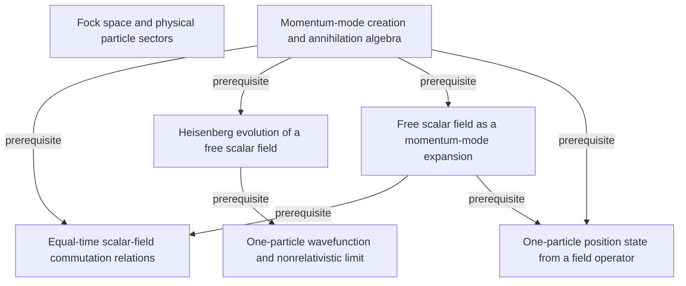

# Quantum Field Theory and the Standard Model

**Model-reviewed textbook graph:** 875 concepts and 972 relationships. Accepted units cover printed pages 3–105, 109–284, 287–477, 481–699, 703–811, 813, 815–833; exact topic scopes and exclusions are in [review.yaml](review.yaml).

Terra/high extracts the material; independent Sol/high review precedes each promotion. The end human audit is pending. The whole-book assessment and its resolved or pending amendments are recorded in the reconciliation report. Cross-volume correspondence and shared-graph alignment remain in progress. A listed page range records reviewed scope, not a claim that every topic on a pilot page was extracted.

This graph describes the book independently of any audience, course, or schedule. Textbooks, extracted passages, source-page renderings, and processing records remain private.

[Read the graph](knowledge/graph.yaml) · [Coverage inventory](coverage.yaml) · [Final scientific decisions](adjudications.yaml) · [Whole-book reconciliation](reconciliation.md) · [Shared QFT graph](../../subjects/qft/README.md) · [Graph bank instructions](../../README.md)

The following diagram is a small excerpt from the initial accepted batch. The linked YAML contains the current complete set of accepted records.

The diagram omits mastery levels and detailed qualifications for readability; the YAML preserves the evidence, necessity, rationale, and failure mode for every relationship. Textbooks and quotation checks remain local.
