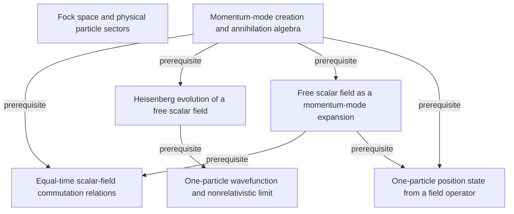

# Quantum Field Theory and the Standard Model

**Partial, model-reviewed graph:** 7 concepts and 7 relationships from printed pages 21–26.

Free scalar-field quantization through the Fock-space description, creation and annihilation operators, field expansion, time evolution, and equal-time commutation relations, with the short closing application kept only as context for the quantum-field description.

Terra/high extracted this batch; Sol/high independently reviewed it before promotion. The end human audit is pending. See [review.yaml](review.yaml) for exact scope, content digests, and omissions.

This graph describes the book independently of any audience, course, or schedule. Earlier supporting sections and the rest of the textbook are not yet extracted.

[Read the graph](knowledge/graph.yaml) · [Shared QFT graph](../../subjects/qft/README.md) · [Graph bank instructions](../../README.md)

The diagram omits mastery levels and detailed qualifications for readability; the YAML preserves the evidence, necessity, rationale, and failure mode for every relationship. Textbooks and quotation checks remain local.
