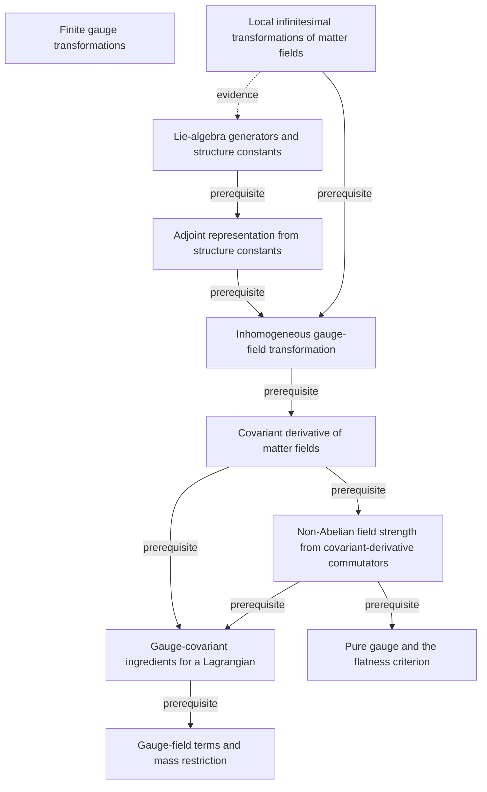

# The Quantum Theory of Fields, Volume II: Modern Applications

**Partial, model-reviewed graph:** 10 concepts and 10 relationships from printed pages 2–7.

Opening non-Abelian gauge-theory construction: local matter-field transformations, Lie-algebra generators and structure constants, covariant derivatives, field strength, and the first gauge-theory Lagrangian ingredients.

Terra/high extracted this batch; Sol/high independently reviewed it before promotion. The end human audit is pending. See [review.yaml](review.yaml) for exact scope, content digests, and omissions.

This graph describes the book independently of any audience, course, or schedule. Earlier supporting sections and the rest of the textbook are not yet extracted.

[Read the graph](knowledge/graph.yaml) · [Shared QFT graph](../../subjects/qft/README.md) · [Graph bank instructions](../../README.md)

The diagram omits mastery levels and detailed qualifications for readability; the YAML preserves the evidence, necessity, rationale, and failure mode for every relationship. Textbooks and quotation checks remain local.
